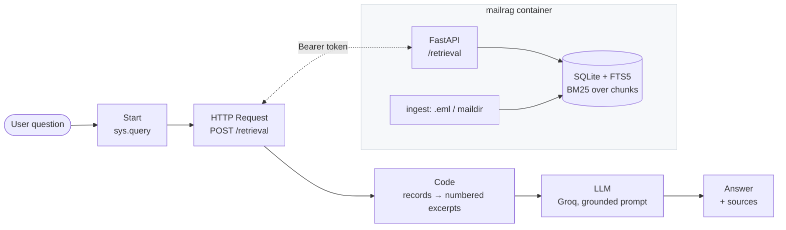

# MailRag

A Dify workflow that answers questions about an **email archive** by calling a small
retrieval service, and cites the message every fact came from.

The interesting part is the seam, not the volume of code: Dify owns the
conversation, the prompt and the model; a ~250-line service owns the mail and the
retrieval. They meet over Dify's own **External Knowledge API** contract, which
means the *same* endpoint can be driven two ways — by an HTTP Request node in a
workflow, or by Dify itself as an external knowledge base — with nothing changed on
the service side.



## What's in here

| Path | What it is |
| --- | --- |
| `workflows/mailrag-chatflow.yml` | **The demo.** Chatflow DSL: Start → HTTP Request → Code → LLM → Answer. Imports and runs as-is. |
| `workflows/mailrag-external-kb.yml` | The same thing with Dify doing the retrieval call, via an external knowledge base (3 nodes, native citations). |
| `rag/store.py` | Schema, FTS5 index, BM25 search (~150 lines). |
| `rag/ingest.py` | `.eml` / maildir → chunks. Standard library only (~160 lines). |
| `rag/app.py` | The Dify contract: `POST /retrieval`, `/health`, `/reindex` (~110 lines). |
| `samples/*.eml` | 8 synthetic mails (EN + VI) with checkable facts: quote, PO, serials, delay, RMA, invoice. |
| `docker-compose*.yml`, `Dockerfile`, `Makefile` | One service, one volume, one command. |

No Dify source is vendored here — Dify runs from its own images, and this repo is
the part that plugs into it.

## Run it

**1. Start the retrieval service on Dify's network**

```bash
cp .env.example .env          # edit MAILRAG_API_KEY
make dify-up                  # == docker compose -f docker-compose.yml -f docker-compose.dify.yml up -d --build
make health                   # {"status":"ok","emails":8,"chunks":8}
make ask Q="which serial number was RMA'd?"
```

`DIFY_NETWORK` in `.env` is the docker network Dify runs on (`docker_default` when
Dify's compose lives in `dify/docker`). The service is then reachable from Dify's
containers as `http://mailrag:8000`.

**2. Let Dify's SSRF proxy reach it**

Every outbound request from an HTTP Request node (and from external-knowledge
retrieval) goes through Dify's `ssrf_proxy`, which **denies private destinations by
default** — a squid `403`, before your service is ever contacted. Allowlist the
host in Dify's `docker/.env`:

```bash
SSRF_PROXY_ALLOW_PRIVATE_DOMAINS=mailrag
```

then `docker compose up -d ssrf_proxy` in Dify's `docker/` directory. (Verified on
Dify 1.16: from inside the `api` container, `http://mailrag:8000/health` returns
200 directly and squid `403`s through the proxy until this is set.)

**3. Import the workflow**

Dify → Studio → *Create from DSL* → upload `workflows/mailrag-chatflow.yml`.

Two things the DSL cannot carry, because they live in your workspace:

- **The model.** Settings → Model Provider → install **Groq** → paste your key, then
  pick the model on the LLM node. The node ships set to
  `langgenius/groq/groq` + `llama-3.3-70b-versatile`; any OpenAI-compatible provider
  works just as well.
- **The token**, if you changed `MAILRAG_API_KEY`: HTTP node → Authorization →
  Bearer.

Then run it and ask something the archive can actually answer:

> What unit price was quoted for PO-48812, and what changed on 1 May 2026?

You should get the quoted `USD 2,480.00`, the increase to `USD 2,610.00`, and
`[Source N]` markers matching the citation list under the answer.

## The contract

```http
POST /retrieval
Authorization: Bearer <MAILRAG_API_KEY>
Content-Type: application/json

{"knowledge_id": "emails",
 "query": "ngày giao mới của 4 thiết bị còn lại?",
 "retrieval_setting": {"top_k": 5, "score_threshold": 0}}
```

```json
{"records": [
  {"content": "Subject: PO-48812 - 4 thiet bi con lai... | From: ... | Date: 2026-03-05\n\nNgày giao dự kiến mới là 12/03/2026 ...",
   "title": "PO-48812 - 4 thiet bi con lai bi cham do thong quan",
   "score": 1.0,
   "metadata": {"source": "05-cham-giao-hang.eml", "from": "...", "sent_at": "2026-03-05T17:48:30+07:00", "chunk": 0}}
]}
```

This is Dify's documented shape, including its error envelope: `1001` malformed
`Authorization` header, `1002` bad key, `2001` unknown `knowledge_id`. `metadata`
must be an object — Dify writes the score and title into it before the chunk
reaches the model, and a `null` there silently loses both.

## Design notes

**Why keyword search, not embeddings.** Mail questions arrive carrying exact tokens:
`PO-48812`, `INV-2026-0451`, `FOC2512A1BF`. BM25 finds the literal string; a dense
vector cheerfully blurs one purchase order into five others. SQLite's FTS5 gives
BM25 with no vector database, no embedding server and no GPU — the whole archive is
one file you can copy off the machine. The tokenizer is
`unicode61 remove_diacritics 2`, so *cong ty* matches *công ty*: Vietnamese mail is
typed both ways. Adding embeddings later means replacing `search()` and fusing two
rankings — nothing above it changes, which is exactly why the seam is where it is.

**Every chunk repeats its subject / sender / date.** Chunks are retrieved in
isolation; without that header only the first chunk of a thread could answer *who
sent this, and when?*

**At most two chunks per message reach the model.** Retrieval keeps returning several
slices of the same thread. Uncapped, one chatty thread fills every slot and the
message that actually holds the answer never gets in.

**`score` is relative, and says so.** BM25 is unbounded and is not a probability, so
the API reports strength relative to the best hit for that query — the top hit is
always `1.0`. That makes Dify's `score_threshold` mean something an operator can
reason about (`0.2` = "drop anything less than a fifth as strong as the best hit")
instead of a number whose scale moves with corpus size and query length.

**The prompt is the guardrail.** Excerpts only, exact quoting of identifiers and
prices, `[Source N]` citations, and an explicit instruction to say *not found* —
with `NO_RESULTS` passed through as a signal when retrieval comes back empty, since
an empty context is an invitation to answer from memory. On an archive of invoices
and serial numbers, a confident invented number is worse than no answer.

**Ingest is idempotent.** Each file is fingerprinted (sha1); unchanged files are
skipped, changed ones have their chunks rebuilt wholesale — boundaries move when a
body changes, so a partial update would leave stale text indexed. Safe to run from
cron against a live maildir.

## Your own mail

```bash
MAILRAG_MAIL_SOURCE=/var/mail/archive/example.com make dify-up
make ingest
```

It reads flat `.eml` directories and maildir trees alike, skipping `.Trash`,
`.Drafts` and `.Templates`. Attachment *names* are indexed (they are often the
answer to "which quote did they attach?"); attachment bytes are dropped.

## Limits, and what I would add next

- **Retrieval is keyword-only.** Paraphrased questions with no shared tokens are its
  weak spot; the fix is hybrid retrieval — embeddings plus BM25 fused with
  Reciprocal Rank Fusion, then a cross-encoder rerank over the union.
- **No metadata filtering.** `metadata_condition` is accepted and ignored, so "only
  2026" has to be said in words rather than filtered in SQL.
- **One knowledge id, one archive.** Multi-tenant would mean a knowledge id per
  mailbox and a token per tenant.
- **Vector scan would be linear** if embeddings were added as-is; past a few tens of
  thousands of chunks that wants `sqlite-vec` or pgvector.
- The workflow DSL is written against the Dify 1.16 schema (DSL `0.6.0`). The
  retrieval service is verified end to end — health, retrieval, all three error
  codes, and reachability from inside Dify's `api` container.

---

## Hướng dẫn nhanh (Tiếng Việt)

Demo: **workflow Dify gọi RAG API lấy dữ liệu email**, trả lời có trích dẫn nguồn.

1. `cp .env.example .env` → sửa `MAILRAG_API_KEY`, rồi `make dify-up`. Kiểm tra:
   `make health`.
2. Trong `docker/.env` của Dify thêm `SSRF_PROXY_ALLOW_PRIVATE_DOMAINS=mailrag` rồi
   khởi động lại `ssrf_proxy` — nếu không, node HTTP bị squid chặn (403) vì đích là
   địa chỉ nội bộ.
3. Dify → Studio → *Create from DSL* → tải `workflows/mailrag-chatflow.yml`.
4. Cài plugin **Groq** trong Settings → Model Provider, dán API key, chọn model ở
   node LLM. Key Groq nằm ở Dify, **không** nằm trong repo này.
5. Hỏi thử: *"Ngày giao mới của 4 thiết bị còn lại của PO-48812 là ngày nào?"* →
   phải trả lời `12/03/2026` kèm `[Source N]`.

Dữ liệu mẫu trong `samples/` là email hư cấu (EN + VI) có sẵn số PO, số serial, giá
và ngày để kiểm tra câu trả lời có đúng nguồn hay không. Muốn chạy với mail thật:
`MAILRAG_MAIL_SOURCE=/đường/dẫn/maildir make dify-up && make ingest`.
